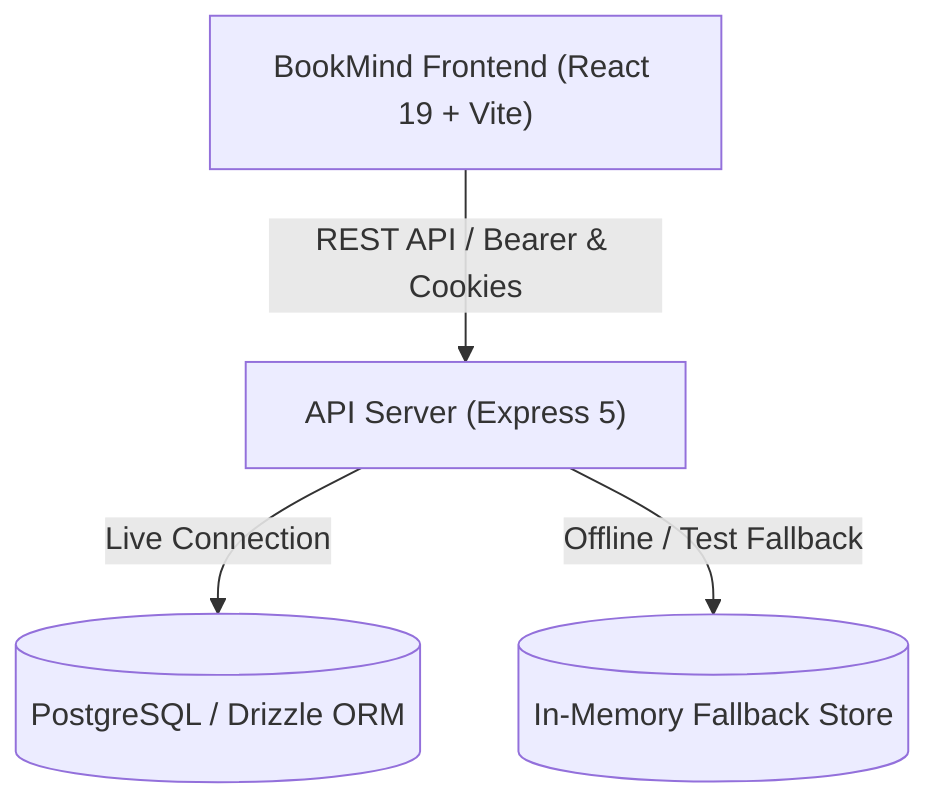

# BookMind Architecture & Technical Foundation (BM-PRD-02)

## 1. Overview

BookMind is a focused, bilingual reading application designed for deep retention and thoughtful reading. The platform is architected around modular domains, OpenAPI-driven contracts, Drizzle ORM persistence, and a modern React 19 frontend with warm editorial aesthetics.



---

## 2. Monorepo Structure

```
├── artifacts/
│   ├── bookmind/           # Frontend Web Application (React 19, Vite, TailwindCSS)
│   └── api-server/         # Express 5 backend server (bundled with esbuild + pino)
├── lib/
│   ├── db/                 # Drizzle ORM schema, migrations, connection manager
│   ├── api-spec/           # OpenAPI 3.1 schema & Orval codegen configuration
│   ├── api-zod/            # Generated Zod validation schemas
│   └── api-client-react/   # Generated TanStack Query React hooks & custom fetch
├── scripts/
│   └── tests/              # End-to-end and integration automated test suites
├── docs/
│   ├── architecture.md     # System architecture documentation
│   └── legacy/             # Archived historical notes (replit.md)
└── .github/workflows/
    └── ci.yml              # Continuous integration pipeline
```

---

## 3. Database Schema

The persistence layer defines 9 core relational tables in `lib/db/src/schema/`:

1. **`users`**: User identity, email, PBKDF2/scrypt password hashes, display name, timestamps.
2. **`user_preferences`**: Language (`es-MX` | `en-US`), theme (`light` | `dark` | `system`), reading mode, font size.
3. **`books`**: Book records tied to `users.id` with cascade deletion, titles, authors, page counts, current page.
4. **`book_files`**: Physical file paths, MIME types, checksums, and storage metadata.
5. **`book_pages`**: Text content, OCR confidence metrics, and blank page flags.
6. **`reading_progress`**: Current page, percentage, completion flag, and last read timestamp per user and book.
7. **`bookmarks`**: User bookmarks referencing specific pages in a book.
8. **`notes`**: Page-level user notes with highlight text, markdown content, and color tags.
9. **`processing_jobs`**: Status tracking for PDF parsing, text extraction, and future OCR pipelines.

Migrations are managed with Drizzle Kit in `lib/db/migrations/`.

---

## 4. Internationalization (i18n)

BookMind supports full bilingual localization:
- **`es-MX`**: Spanish (Mexico) — default product language.
- **`en-US`**: English (United States).

Translations are organized into 8 modular namespaces:
- `common`: Global actions, branding, shell navigation, theme labels.
- `auth`: Login, registration, credential validations, session feedback.
- `library`: Hero copy, search, book cards, statistics, and empty states.
- `reader`: Header controls, reading toolbar, page indicator, AI reflections.
- `notes`: Note editor, creation, update, deletion, and auto-save indicators.
- `study`: Study mode placeholder and BM-PRD-07 preview notices.
- `settings`: Visual theme, language preferences, and account management.
- `errors`: Network errors, 404, missing books, and error fallbacks.

The active language synchronizes automatically with `document.documentElement.lang` and is persisted in user preferences.

---

## 5. Security & Authentication

- Passwords are encrypted using standard Node.js crypto primitives (`crypto.scryptSync` with random salt).
- Sessions are managed with secure HTTP-only cookies (`session_token`) and optional `Authorization: Bearer <token>` headers.
- Strict server-side ownership isolation: all book, reading progress, bookmark, and note operations strictly verify that `userId === req.user.id`.

---

## 6. Offline & PWA Capability

- Web App Manifest configured at `/manifest.webmanifest`.
- Service Worker registered at `/sw.js` with stale-while-revalidate strategy for assets and network-first for API routes.
- Dual-layer data repository: if no live PostgreSQL instance is present, the API server seamlessly operates with an in-memory repository seeded with Kafka's *Metamorfosis* and Berger's *Ways of Seeing*, ensuring zero-friction local development and automated testing.
