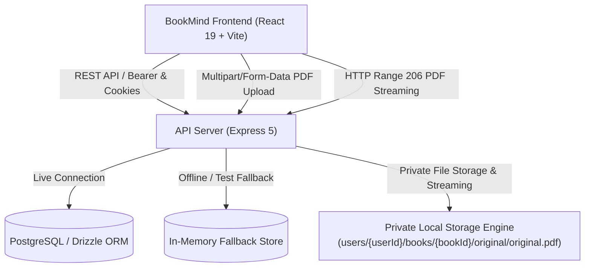

# BookMind Architecture & Technical Foundation (BM-PRD-03)

## 1. Overview

BookMind is a focused, bilingual reading application designed for deep retention and thoughtful reading. The platform is architected around modular domains, OpenAPI-driven contracts, Drizzle ORM persistence, private local storage, and a modern React 19 frontend with warm editorial aesthetics.



---

## 2. Monorepo Structure

```
├── artifacts/
│   ├── bookmind/           # Frontend Web Application (React 19, Vite, TailwindCSS)
│   └── api-server/         # Express 5 backend server (bundled with esbuild + pino)
│       └── src/services/
│           ├── storage/    # LocalPrivateStorage provider & path traversal defense
│           └── pdf-ingestion/ # Validation, SHA-256, pdf-lib inspection & orchestrator
├── lib/
│   ├── db/                 # Drizzle ORM schema, migrations, connection manager
│   ├── api-spec/           # OpenAPI 3.1 schema & Orval codegen configuration
│   ├── api-zod/            # Generated Zod validation schemas
│   └── api-client-react/   # Generated TanStack Query React hooks & custom fetch
├── scripts/
│   ├── fixtures/           # Valid and invalid PDF test fixtures
│   └── tests/              # End-to-end and integration automated test suites
├── docs/
│   ├── architecture.md     # System architecture documentation
│   └── legacy/             # Archived historical notes (replit.md)
└── .github/workflows/
    └── ci.yml              # Continuous integration pipeline
```

---

## 3. Database Schema

The persistence layer defines 9 core relational tables in `lib/db/src/schema/`:

1. **`users`**: User identity, email, PBKDF2/scrypt password hashes, display name, timestamps.
2. **`user_preferences`**: Language (`es-MX` | `en-US`), theme (`light` | `dark` | `system`), reading mode, font size.
3. **`books`**: Book records tied to `users.id` with cascade deletion, title, author, totalPages, currentPage, `processingStatus` (`ready_for_processing`), `sourceType` (`pdf`), `deletedAt`.
4. **`book_files`**: Physical file paths, MIME types, `originalFilename`, `storageProvider` (`local`), `checksumSha256`, `uploadStatus`.
5. **`book_pages`**: Text content, OCR confidence metrics, and blank page flags (reserved for BM-PRD-04).
6. **`reading_progress`**: Current page, percentage, completion flag, and last read timestamp per user and book.
7. **`bookmarks`**: User bookmarks referencing specific pages in a book.
8. **`notes`**: Page-level user notes with highlight text, markdown content, and color tags.
9. **`processing_jobs`**: Status tracking for PDF parsing, `stage`, progress percentage, and error messages.

Migrations are managed with Drizzle Kit in `lib/db/migrations/`.

---

## 4. PDF Ingestion Engine & Private Local Storage (BM-PRD-03)

### 4.1 Ingestion Pipeline

```text
PDF REAL
   ↓
UPLOAD (Multer to data/tmp/ with size limit 100MB)
   ↓
VALIDACIÓN (Empty check, MIME check, binary signature %PDF-)
   ↓
HASH CRIPTOGRÁFICO (SHA-256 streamed)
   ↓
USER-LEVEL DEDUPLICATION (Check existing userId + checksumSha256 -> 409 PDF_DUPLICATE)
   ↓
PDF INSPECTION (pdf-lib: pageCount extraction, encryption check, title & author metadata)
   ↓
ALMACENAMIENTO PRIVADO (Move to data/storage/users/{userId}/books/{bookId}/original/original.pdf)
   ↓
REGISTRO ATÓMICO (books + book_files + processing_jobs with rollback compensation)
   ↓
LIBRO EN BIBLIOTECA (status: ready_for_processing, real totalPages)
```

### 4.2 Storage Organization & Isolation

- File storage root: `BOOKMIND_STORAGE_ROOT` (default `./data/storage`).
- Logical path format: `users/{userId}/books/{bookId}/original/original.pdf`.
- Database records only store logical normalized paths, never absolute host machine paths.
- Defense against directory traversal: strict normalization strips `..`, `.`, leading slashes, and verifies canonical path starts with the configured root directory.
- Deduplication is strictly user-scoped: cross-user deduplication never leaks whether another user owns the same file.

### 4.3 Authorized PDF Streaming & HTTP Range Requests

- `GET /books/:id/original` enforces strict ownership: requesting another user's file returns `404 Not Found`.
- Full stream: HTTP 200 with `Content-Type: application/pdf`, `Content-Length`, `Accept-Ranges: bytes`.
- Byte-range stream: HTTP 206 Partial Content with `Content-Range: bytes start-end/total` enabling progressive streaming in PDF readers.

### 4.4 Invariant: "El original nunca se destruye"

The ingested original PDF file is immutable and preserved in private storage. Future processing stages (OCR, text extraction, embeddings) never modify or delete the original source PDF.

---

## 5. Internationalization (i18n)

BookMind supports full bilingual localization:
- **`es-MX`**: Spanish (Mexico) — default product language.
- **`en-US`**: English (United States).

Translations are organized into 8 modular namespaces:
- `common`: Global actions, branding, shell navigation, theme labels.
- `auth`: Login, registration, credential validations, session feedback.
- `library`: Hero copy, search, book cards, statistics, empty states, and PDF import stages.
- `reader`: Header controls, reading toolbar, page indicator, AI reflections.
- `notes`: Note editor, creation, update, deletion, and auto-save indicators.
- `study`: Study mode placeholder and BM-PRD-07 preview notices.
- `settings`: Visual theme, language preferences, and account management.
- `errors`: Network errors, 404, missing books, and all standard PDF ingestion error codes (`PDF_EMPTY`, `PDF_TOO_LARGE`, `PDF_INVALID_SIGNATURE`, `PDF_CORRUPTED`, `PDF_DUPLICATE`, etc.).

---

## 6. Security & Authentication

- Passwords are encrypted using standard Node.js crypto primitives (`crypto.scryptSync` with random salt).
- Sessions are managed with secure HTTP-only cookies (`session_token`) and optional `Authorization: Bearer <token>` headers.
- Strict server-side ownership isolation: all book, reading progress, bookmark, note, and PDF original file operations strictly verify that `userId === req.user.id`.

---

## 7. Offline & PWA Capability

- Web App Manifest configured at `/manifest.webmanifest`.
- Service Worker registered at `/sw.js` with stale-while-revalidate strategy for assets and network-first for API routes.
- Dual-layer data repository: if no live PostgreSQL instance is present, the API server seamlessly operates with an in-memory repository seeded with Kafka's *Metamorfosis* and Berger's *Ways of Seeing*, ensuring zero-friction local development and automated testing.
